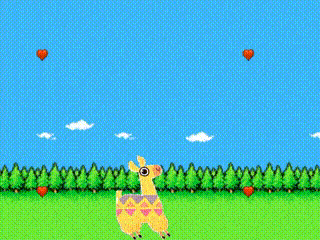

## Llama!



# Wtf?

This was my hackathon project for the PyDDF Düsseldorf sprint 2017.  
It is written in Python using cocos2d.

# Installation

Please follow the guidelines [here](http://python.cocos2d.org/doc/programming_guide/installation.html) to install coco2d.

# Running the game

```
python llama.py
```
